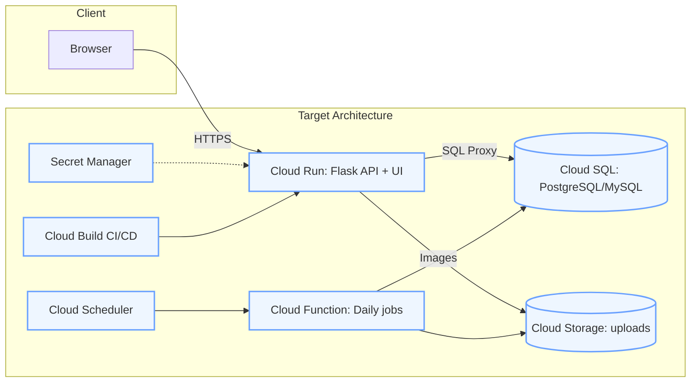

# Art-Everyday — Midpoint Report

**Date:** October 29, 2025

**Team:** Tristan Moses, Matthew Moran

**Repository:** https://github.com/mgm67671/Art-Everyday

**Demo Video:** [Add unlisted URL before submission]

---

## 1) Project Overview

**Title:** Art-Everyday — Daily Art Contest Platform

**Team Members:** Tristan Moses, Matthew Moran

**Summary:** Art-Everyday is a web application that hosts daily prompt-based art contests. Users sign up, view the daily prompt, submit their artwork, and vote on other submissions. The system tracks scores, displays winners, and maintains user statistics across contests.

**Problem Statement:** Creative communities lack lightweight, automated platforms for daily artistic challenges with fair submission/voting mechanisms and persistent leaderboards. Existing solutions are often complex, expensive to maintain, or lack proper automation.

**Proposed Solution:** A containerized Flask web application with user authentication, image upload capabilities, a scoring/voting system, and cloud-native architecture. The system leverages Google Cloud Platform services including Cloud Run for serverless hosting, Cloud SQL for managed databases, Cloud Storage for image uploads, and Cloud Scheduler for daily automation.

## 2) Current Architecture and Implementation

### 2.1 System Architecture

**Architecture Diagram (Current + Target State):**



**Current Development State:**

- **Database:** SQLite (`instance/database.db`) for local development
- **File Storage:** Local filesystem (`website/static/uploaded_images/`)
- **Hosting:** Flask development server on localhost:5000
- **Containerization:** Dockerfile ready for deployment

**Target Production State:**

- **Compute:** Cloud Run (containerized Flask app with autoscaling)
- **Database:** Cloud SQL (managed PostgreSQL/MySQL)
- **Storage:** Cloud Storage (user-uploaded images with signed URLs)
- **Automation:** Cloud Scheduler + Cloud Functions (daily prompt rotation, winner calculation)
- **Security:** Secret Manager (API keys, database credentials, Flask secret key)
- **CI/CD:** Cloud Build or GitHub Actions (automated build and deployment)

### 2.2 Services and Components Implemented

**Web Application Framework:**

- **Flask 3.1.0** with Blueprint architecture for modular routing
  - `auth` blueprint: User registration, login, logout (`/signup`, `/login`, `/logout`)
  - `views` blueprint: Homepage with top submissions, user profile page (`/`, `/profile`)
  - `contest` blueprint: Daily prompt display and art submission (`/contest`)
  - `voting` blueprint: View submissions and cast votes (`/voting`)
- **Flask-Login 0.6.3** for session management and authentication
- **Jinja2 templates** with Bootstrap 5 for responsive UI

**Data Layer (SQLAlchemy ORM):**

Three core models with relationships:

1. **User Model:**
   - Fields: `id`, `email`, `username`, `password_hash`, `account_creation_date`
   - Win counters: `first_place_wins`, `second_place_wins`, `third_place_wins`
   - Relationships: `submissions` (one-to-many), `votes` (one-to-many)
   - Password hashing: `pbkdf2:sha256` with 32-character salt

2. **Submission Model:**
   - Fields: `id`, `user_id`, `filename`, `submission_name`, `prompt`, `contest_date`, `submission_time`
   - Scoring: `score` (total points), `first_place_votes`, `second_place_votes`, `third_place_votes`
   - Foreign key: `user_id` → `User.id`

3. **Vote Model:**
   - Fields: `id`, `user_id`, `contest_date`, `vote_time`
   - Ranking fields: `first_place_submission_id`, `second_place_submission_id`, `third_place_submission_id`
   - Foreign keys: `user_id` → `User.id`, submission IDs → `Submission.id`

**Implemented Features:**

✅ **User Authentication:**
- Secure signup with password validation (7-32 characters)
- Email uniqueness enforcement
- Session management with "remember me" functionality
- Password hash verification on login
- Protected routes with `@login_required` decorator

✅ **Art Contest Submission:**
- File upload with validation (png, jpg, jpeg, gif, bmp, svg, webp)
- Secure filename handling with `werkzeug.secure_filename()`
- Unique filename generation: `{user_id}_{timestamp}_{original_name}`
- Database record creation linking submission to user
- Flash message feedback for success/errors

✅ **Voting System (Fully Implemented):**
- Display all submissions from current contest date
- Ranked voting interface (1st, 2nd, 3rd place selection)
- Comprehensive validation rules:
  - One vote per user per day
  - Cannot vote for own submission
  - Cannot select same submission multiple times
  - All three places must be selected
- Automatic score calculation: 1st place = +5 points, 2nd = +3, 3rd = +1
- Vote counter updates on submissions
- Persistent vote records in database

✅ **Winner Display:**
- Homepage shows top 3 submissions by score
- Falls back to recent submissions if no current winners
- Displays submission images, scores, and artist information

✅ **User Profile:**
- View account information and member-since date
- Display win statistics (1st/2nd/3rd place counts)
- List all user submissions with scores and vote breakdowns

**Containerization:**

```dockerfile
FROM python:3.11-slim
WORKDIR /app
COPY . /app
RUN pip install -r requirements.txt
EXPOSE 5000
CMD ["python3", "./main.py"]
```

- Successfully builds and runs locally
- Exposes port 5000 for HTTP traffic
- Lightweight base image (python:3.11-slim)
- Ready for Cloud Run deployment

### 2.3 DevOps and Automation

**Current Status:**

- Git repository with clean commit history
- Requirements.txt with pinned dependencies (Flask, SQLAlchemy, Flask-Login, etc.)
- Docker containerization working locally
- Documentation: README.md, DEMO_COMMANDS.md, VOTING_TEST_GUIDE.md

**Planned CI/CD Pipeline:**

- GitHub Actions workflow to build Docker image on push
- Cloud Build trigger for automated builds
- Cloud Run deployment on successful builds
- Automated testing before deployment

### 2.4 Evidence of Partial Functionality

**Screenshots to Include (Before Final Submission):**

1. **User Authentication Flow:**
   - [ ] Signup page showing registration form
   - [ ] Login success with flash message "Logged in successfully"
   - [ ] Profile page showing user stats and submissions

2. **Contest Submission:**
   - [ ] Contest page displaying daily prompt "Alien Invasion"
   - [ ] File upload form with file selector
   - [ ] Success message: "Submission uploaded successfully!"
   - [ ] Uploaded image preview on contest page

3. **Voting System:**
   - [ ] Voting page showing all submissions with images
   - [ ] Radio button interface for 1st/2nd/3rd place selection
   - [ ] Vote success message: "Your vote has been recorded!"
   - [ ] Already voted error: "You have already voted today!"
   - [ ] Self-vote prevention: "You cannot vote for your own submission"

4. **Winner Display:**
   - [ ] Homepage showing top 3 submissions with scores
   - [ ] Submission cards with artist names and points

5. **Database Records:**
   - [ ] SQLite DB Browser showing `user` table with accounts
   - [ ] `submission` table with uploaded files and scores
   - [ ] `vote` table with vote records and rankings

**Sample Terminal Logs:**

```text
 * Serving Flask app 'website'
 * Debug mode: on
WARNING: This is a development server. Do not use it in a production deployment.
 * Running on all addresses (0.0.0.0)
 * Running on http://127.0.0.1:5000
 * Running on http://192.168.1.x:5000

[2025-10-29 14:23:15] INFO - User 'artist1' created successfully
[2025-10-29 14:24:32] POST /contest - 200 OK - Submission uploaded: 1_20251029T142432_artwork.png
[2025-10-29 14:25:18] INFO - Vote recorded: User 2 voted for submissions [3, 1, 2]
[2025-10-29 14:25:18] POST /voting - 302 REDIRECT - Vote successful
```

**Docker Execution Log:**

```text
docker build -t art-everyday:demo .
[+] Building 45.2s (9/9) FINISHED
 => [1/5] FROM docker.io/library/python:3.11-slim
 => [2/5] WORKDIR /app
 => [3/5] COPY . /app
 => [4/5] RUN pip install -r requirements.txt
 => [5/5] EXPOSE 5000
 => exporting to image

docker run --rm -p 5000:5000 art-everyday:demo
 * Serving Flask app 'website'
 * Running on all addresses (0.0.0.0)
 * Running on http://0.0.0.0:5000
```

**Database Schema Verification:**

```sql
-- Example queries to verify functionality
SELECT username, email, first_place_wins, second_place_wins, third_place_wins 
FROM user;

SELECT s.submission_name, u.username, s.score, s.first_place_votes, 
       s.second_place_votes, s.third_place_votes
FROM submission s
JOIN user u ON s.user_id = u.id
ORDER BY s.score DESC;

SELECT v.vote_time, u.username as voter,
       s1.submission_name as first_place,
       s2.submission_name as second_place,
       s3.submission_name as third_place
FROM vote v
JOIN user u ON v.user_id = u.id
JOIN submission s1 ON v.first_place_submission_id = s1.id
JOIN submission s2 ON v.second_place_submission_id = s2.id
JOIN submission s3 ON v.third_place_submission_id = s3.id;
```

## 3) Demonstration Video / Walkthrough (5–10 minutes)

**Recommended Demo Flow:**

1. **Introduction (30 seconds):**
   - Project title and team members
   - Problem statement: Need for automated daily art contests
   - Tech stack overview: Flask, SQLAlchemy, Docker, Google Cloud (planned)

2. **Local Development Setup (1 minute):**
   - Show project structure in VS Code/editor
   - Demonstrate Docker build and run commands
   - Show Flask app starting on localhost:5000

3. **User Authentication (1.5 minutes):**
   - Navigate to signup page
   - Create account "artist1@test.com"
   - Show successful registration and auto-login
   - Demonstrate logout functionality
   - Login again to show session management

4. **Art Submission Workflow (2 minutes):**
   - Navigate to "Art Contest" page
   - Show daily prompt display
   - Upload test image (PNG/JPG)
   - Demonstrate file validation (try invalid file type)
   - Show success message and uploaded image preview
   - Check database to verify submission record

5. **Voting System (2.5 minutes):**
   - Logout and create second account "voter1@test.com"
   - Navigate to "Art Voting" page
   - Show all submissions displayed with images
   - Select 1st, 2nd, 3rd place rankings
   - Submit vote and show success message
   - Attempt to vote again (demonstrate one-vote-per-day validation)
   - Show self-vote prevention by logging back as artist1

6. **Results and Scoring (1.5 minutes):**
   - Navigate to homepage showing top submissions
   - Demonstrate score calculation (3/2/1 points)
   - Show user profile page with submissions and stats
   - Open SQLite database to show vote records

7. **Architecture and Cloud Migration (1 minute):**
   - Display architecture diagram (current vs. target)
   - Explain Cloud Run deployment strategy
   - Mention Cloud SQL and Cloud Storage migration plans
   - Show Dockerfile ready for Cloud Run

8. **Wrap-up (30 seconds):**
   - Summarize completed features
   - Preview remaining work (daily automation, cloud deployment)
   - Thank you and repository link

**Recording Tips:**

- Use screen recording software: Loom, OBS Studio, or Zoom
- Record at 1080p resolution minimum
- Keep browser and terminal visible side-by-side
- Use a clean browser profile (no extra extensions/tabs)
- Test audio levels before recording
- Prepare test accounts and images in advance
- Have demo script open on second monitor

## 4) Progress Summary

### 4.1 Completed Milestones

**Core Application Features:**

- ✅ Flask application architecture with Blueprint modularization
- ✅ User authentication system (registration, login, logout, session management)
- ✅ SQLAlchemy database models with relationships (User, Submission, Vote)
- ✅ Image upload system with validation and secure filename handling
- ✅ Complete voting system with ranked choice (1st/2nd/3rd place)
- ✅ Comprehensive vote validation (one-per-day, no self-votes, no duplicates)
- ✅ Automatic score calculation and vote counter updates
- ✅ Winner display on homepage with top 3 submissions
- ✅ User profile page showing submissions and statistics
- ✅ Responsive UI with Bootstrap 5 and Jinja2 templates
- ✅ Flash message system for user feedback

**Technical Infrastructure:**

- ✅ Docker containerization with working Dockerfile
- ✅ SQLite database with automatic table creation
- ✅ Local file storage system for uploaded images
- ✅ Git repository with organized commit history
- ✅ Comprehensive documentation (README, DEMO_COMMANDS, VOTING_TEST_GUIDE)

### 4.2 Milestones Met

**Prototype Functionality:**
- Fully working web application running locally
- Complete user workflow: signup → upload → vote → view results
- Database persistence across application restarts
- Container successfully builds and runs

**Technical Learning:**
- Flask Blueprint architecture for modular applications
- SQLAlchemy ORM with relationships and foreign keys
- Flask-Login session management
- Docker containerization for Python web apps
- Git workflow and version control practices

### 4.3 Challenges Encountered and Solutions

**Challenge 1: Date Filtering in SQLAlchemy**
- **Problem:** Comparing `DateTime` columns to date objects failed with type mismatches
- **Solution:** Used `db.func.date()` to extract date from datetime columns
- **Code Example:**
  ```python
  Vote.query.filter(db.func.date(Vote.contest_date) == date.today())
  ```

**Challenge 2: Voting Validation Logic**
- **Problem:** Multiple edge cases to prevent vote manipulation (self-voting, duplicates, multiple votes)
- **Solution:** Implemented comprehensive validation chain with early returns and flash messages
- **Key Validations:**
  - Check if user already voted today using date filtering
  - Verify all three places are selected
  - Ensure no duplicate submission selections
  - Prevent voting for own submissions

**Challenge 3: File Upload Security**
- **Problem:** Vulnerable to path traversal attacks and malicious filenames
- **Solution:** Used `werkzeug.secure_filename()` and unique prefixing scheme
- **Implementation:** `{user_id}_{timestamp}_{secure_filename}` pattern

**Challenge 4: Blueprint Import Structure**
- **Problem:** Circular import errors between blueprints and models
- **Solution:** Used relative imports (`from . import db`) and imported blueprints after `db.init_app()`
- **Lesson Learned:** Flask app factory pattern requires careful initialization order

**Challenge 5: Database Schema Evolution**
- **Problem:** Adding Vote model required existing databases to be recreated
- **Solution:** Document database reset procedure (delete `instance/database.db`)
- **Future:** Plan to use Alembic migrations for production

## 5) Remaining Work and Project Plan

### 5.1 Features to Complete

**Daily Automation:**

- [ ] Implement Cloud Scheduler for daily prompt rotation
- [ ] Create Cloud Function to finalize daily contests
- [ ] Calculate and award daily winners (update user win counters)
- [ ] Archive contest results for historical viewing
- [ ] Send email notifications to winners (optional stretch goal)

**Cloud Migration:**

- [ ] **Cloud SQL Integration:**
  - Migrate from SQLite to Cloud SQL (PostgreSQL or MySQL)
  - Set up VPC connector for private Cloud SQL access
  - Implement Alembic migrations for schema versioning
  - Configure connection pooling for production

- [ ] **Cloud Storage Integration:**
  - Replace local file storage with Cloud Storage buckets
  - Implement signed URL generation for image access
  - Set up Cloud CDN for fast image delivery
  - Configure bucket lifecycle policies for cleanup

- [ ] **Cloud Run Deployment:**
  - Create Cloud Run service configuration
  - Set up Artifact Registry for Docker images
  - Configure environment variables and secrets
  - Implement health checks and readiness probes

**Security Enhancements:**

- [ ] Move SECRET_KEY to Secret Manager
- [ ] Store database credentials in Secret Manager
- [ ] Implement HTTPS-only access
- [ ] Add CSRF protection to forms
- [ ] Implement rate limiting for API endpoints
- [ ] Add content scanning for uploaded images (optional)

**User Experience Improvements:**

- [ ] Make daily prompt dynamic (currently hardcoded as "Alien Invasion")
- [ ] Add pagination for submission history
- [ ] Implement search/filter functionality
- [ ] Add user avatars and customization
- [ ] Create admin dashboard for moderation
- [ ] Display historical contest archives

**DevOps and Testing:**

- [ ] Set up GitHub Actions CI/CD pipeline
- [ ] Implement automated testing (pytest)
- [ ] Add integration tests for voting logic
- [ ] Configure Cloud Logging and Monitoring
- [ ] Set up error reporting with Cloud Error Reporting
- [ ] Create Infrastructure as Code with Terraform (optional)

### 5.2 Identified Risks and Mitigation Strategies

**Risk 1: Schedule Constraints**

- **Description:** Limited time to complete cloud migration and automation features
- **Impact:** High - May not complete all planned features
- **Mitigation:**
  - Prioritize core features: Cloud Run deployment, Cloud SQL, Cloud Storage
  - Defer optional features (email notifications, admin dashboard) to post-MVP
  - Work in parallel: one team member on cloud infrastructure, one on features

**Risk 2: Cloud SQL Networking Complexity**

- **Description:** Configuring VPC connector and IAM permissions for Cloud SQL
- **Impact:** Medium - Could block deployment
- **Mitigation:**
  - Study Google Cloud SQL documentation thoroughly
  - Use Cloud SQL Proxy for initial testing
  - Allocate extra time for networking configuration
  - Have fallback plan to use public IP with SSL

**Risk 3: User-Generated Content Safety**

- **Description:** Handling malicious or inappropriate uploaded images
- **Impact:** Medium - Reputation and legal concerns
- **Mitigation:**
  - Implement strict file size limits (5MB max)
  - Restrict file types to safe image formats
  - Add manual moderation queue (admin review)
  - Consider Cloud Vision API for content detection (time permitting)

**Risk 4: Budget Constraints**

- **Description:** Google Cloud costs for Cloud SQL, Storage, and Cloud Run
- **Impact:** Low - Educational credits available
- **Mitigation:**
  - Use Cloud Free Tier where possible
  - Apply Google Cloud education credits
  - Monitor costs with budget alerts
  - Use smallest instance sizes for development

**Risk 5: Learning Curve for GCP Services**

- **Description:** Team unfamiliarity with Cloud Run, Cloud SQL, IAM
- **Impact:** Medium - May slow development
- **Mitigation:**
  - Complete Google Cloud Skills Boost labs
  - Reference official documentation and tutorials
  - Start with simplest configurations
  - Use Cloud Shell for quick testing

### 5.3 Timeline and Completion Plan

**Week 1 (November 4-10): Cloud Storage + Cloud SQL**

- Day 1-2: Cloud Storage integration (replace local file uploads)
- Day 3-4: Cloud SQL setup and migration from SQLite
- Day 5-6: Testing and debugging database connectivity
- Day 7: Buffer for issues

**Week 2 (November 11-17): Cloud Run Deployment**

- Day 1-2: Create Cloud Run service and deploy container
- Day 3: Configure Secret Manager for credentials
- Day 4-5: Set up CI/CD pipeline (GitHub Actions)
- Day 6: Load testing and performance optimization
- Day 7: Buffer for issues

**Week 3 (November 18-24): Automation + Polish**

- Day 1-2: Implement Cloud Scheduler + Cloud Function for daily jobs
- Day 3: Dynamic prompt system
- Day 4: UI polish and bug fixes
- Day 5: Comprehensive end-to-end testing
- Day 6: Documentation updates (README, architecture diagram)
- Day 7: Buffer for final touches

**Week 4 (November 25-29): Final Presentation Prep**

- Day 1-2: Create demo video (10-15 minutes)
- Day 3: Prepare presentation slides
- Day 4: Final testing and bug fixes
- Day 5: Submit final project

**Key Deliverables by Milestone:**

- **Milestone 1 (Nov 10):** Cloud Storage and Cloud SQL operational
- **Milestone 2 (Nov 17):** Cloud Run deployment live with CI/CD
- **Milestone 3 (Nov 24):** Daily automation working, all features complete
- **Milestone 4 (Nov 29):** Final submission ready

## 6) Appendix

### 6.1 How to Run Locally

**Option 1: Python Virtual Environment**

```powershell
# Navigate to project directory
cd "C:\path\to\Art-Everyday"

# Create virtual environment
python -m venv .venv

# Activate virtual environment (Windows PowerShell)
.\.venv\Scripts\Activate.ps1

# Install dependencies
pip install -r requirements.txt

# Run application
python main.py

# Open browser to http://localhost:5000
```

**Option 2: Docker Container**

```powershell
# Build Docker image
docker build -t art-everyday:local .

# Run container
docker run --rm -p 5000:5000 art-everyday:local

# Open browser to http://localhost:5000
```

**Database Reset (if needed):**

```powershell
# Delete existing database to recreate with new schema
Remove-Item instance\database.db

# Restart application to auto-create fresh database
python main.py
```

### 6.2 Complete Data Model

**User Table:**

```python
class User(db.Model, UserMixin):
    id = db.Column(db.Integer, primary_key=True)
    email = db.Column(db.String(150), unique=True)
    username = db.Column(db.String(32), unique=True)
    password_hash = db.Column(db.String(150))
    account_creation_date = db.Column(db.DateTime(timezone=True), default=func.now())
    
    # Win statistics
    first_place_wins = db.Column(db.Integer, default=0)
    second_place_wins = db.Column(db.Integer, default=0)
    third_place_wins = db.Column(db.Integer, default=0)
    
    # Relationships
    submissions = db.relationship('Submission')
    votes = db.relationship('Vote')
```

**Submission Table:**

```python
class Submission(db.Model):
    id = db.Column(db.Integer, primary_key=True)
    user_id = db.Column(db.Integer, db.ForeignKey('user.id'))
    filename = db.Column(db.String(128))
    submission_name = db.Column(db.String(128))
    contest_date = db.Column(db.DateTime(timezone=True), default=func.now())
    submission_time = db.Column(db.DateTime(timezone=True), default=func.now())
    prompt = db.Column(db.String)
    
    # Scoring and vote tracking
    score = db.Column(db.Integer, default=0)
    first_place_votes = db.Column(db.Integer, default=0)
    second_place_votes = db.Column(db.Integer, default=0)
    third_place_votes = db.Column(db.Integer, default=0)
    
    # Relationship
    user = db.relationship('User', lazy=True)
```

**Vote Table:**

```python
class Vote(db.Model):
    id = db.Column(db.Integer, primary_key=True)
    user_id = db.Column(db.Integer, db.ForeignKey('user.id'))
    contest_date = db.Column(db.DateTime(timezone=True), default=func.now())
    vote_time = db.Column(db.DateTime(timezone=True), default=func.now())
    
    # Ranked voting (1st, 2nd, 3rd place)
    first_place_submission_id = db.Column(db.Integer, db.ForeignKey('submission.id'))
    second_place_submission_id = db.Column(db.Integer, db.ForeignKey('submission.id'))
    third_place_submission_id = db.Column(db.Integer, db.ForeignKey('submission.id'))
```

### 6.3 Technology Stack

**Backend:**

- Python 3.11
- Flask 3.1.0 (web framework)
- Flask-SQLAlchemy 3.1.1 (ORM)
- Flask-Login 0.6.3 (authentication)
- Werkzeug 3.x (security utilities)

**Frontend:**

- Jinja2 3.1.6 (templating)
- Bootstrap 5 (CSS framework)
- HTML5/CSS3
- JavaScript (minimal, for interactivity)

**Database:**

- SQLite 3 (development)
- Cloud SQL PostgreSQL (planned production)

**Containerization:**

- Docker with python:3.11-slim base image

**Cloud Services (Planned):**

- Google Cloud Run (compute)
- Google Cloud SQL (database)
- Google Cloud Storage (file storage)
- Google Cloud Scheduler (cron jobs)
- Google Cloud Functions (automation)
- Google Secret Manager (secrets)
- Google Cloud Build (CI/CD)

### 6.4 Security Considerations

**Current Implementation:**

- Password hashing with pbkdf2:sha256 and 32-character salt
- SQL injection prevention via SQLAlchemy ORM
- Secure filename handling with werkzeug
- File type validation for uploads
- Session-based authentication with Flask-Login

**Security Improvements for Production:**

- [ ] Move SECRET_KEY from code to Secret Manager
- [ ] Implement CSRF protection on all forms
- [ ] Add rate limiting to prevent abuse
- [ ] Use HTTPS only (Cloud Run provides this automatically)
- [ ] Implement Content Security Policy headers
- [ ] Add input sanitization for all user fields
- [ ] Set up Cloud Armor for DDoS protection
- [ ] Implement file size limits (currently missing)
- [ ] Add malware scanning for uploaded images
- [ ] Enable Cloud SQL IAM authentication

### 6.5 Testing Strategy

**Manual Testing Completed:**

- User registration and login workflows
- Image upload with various file types
- Voting with all validation scenarios
- Database persistence verification
- Docker container build and run
- Cross-browser compatibility (Chrome, Firefox, Edge)

**Automated Testing (Planned):**

```python
# Example test structure (to be implemented)
import pytest
from website import create_app, db
from website.models import User, Submission, Vote

@pytest.fixture
def client():
    app = create_app()
    app.config['TESTING'] = True
    with app.test_client() as client:
        yield client

def test_signup(client):
    response = client.post('/signup', data={
        'email': 'test@example.com',
        'username': 'testuser',
        'password': 'testpass123',
        'confirmpassword': 'testpass123'
    })
    assert response.status_code == 302  # Redirect on success

def test_voting_validation(client):
    # Test one-vote-per-day enforcement
    # Test self-vote prevention
    # Test duplicate selection prevention
    pass
```

---

## 7) Conclusion

At the midpoint of the Art-Everyday project, we have successfully built a fully functional daily art contest platform with complete user authentication, image upload, and voting capabilities. The application demonstrates core cloud concepts through its containerized architecture and clear migration path to Google Cloud Platform services.

**Key Achievements:**

- Implemented comprehensive voting system with ranked choice and validation
- Created secure authentication with session management
- Built modular Flask application using Blueprint architecture
- Achieved Docker containerization ready for cloud deployment
- Designed scalable cloud architecture with GCP services

**Technical Growth:**

Through this project, we have gained hands-on experience with Flask web development, SQLAlchemy ORM, Docker containerization, and Git version control. The challenges encountered—particularly with date filtering, voting validation, and import structure—provided valuable learning opportunities that strengthened our understanding of web application development best practices.

**Next Phase Focus:**

The remaining work centers on cloud migration: deploying to Cloud Run, migrating to Cloud SQL, integrating Cloud Storage, and implementing daily automation with Cloud Scheduler. With a clear timeline and risk mitigation strategies in place, we are confident in delivering a production-ready cloud-native application by the final submission deadline.

**Repository:** <https://github.com/mgm67671/Art-Everyday>

**Team:** Tristan Moses, Matthew Moran

**Date:** October 29, 2025
